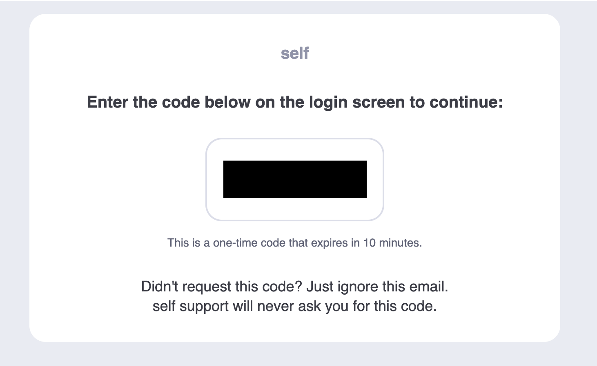
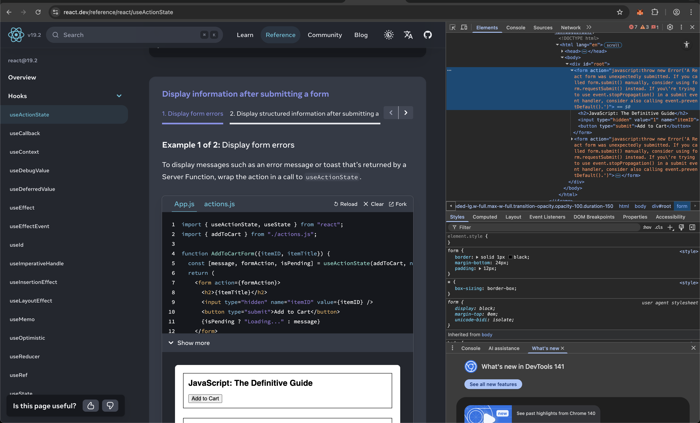

## OTP with email
you should get email from authentication@notification.dynamicauth.com, with one time password for app called "self".

## React issue
The same is at this example https://react.dev/reference/react/useActionState#display-information-after-submitting-a-form
