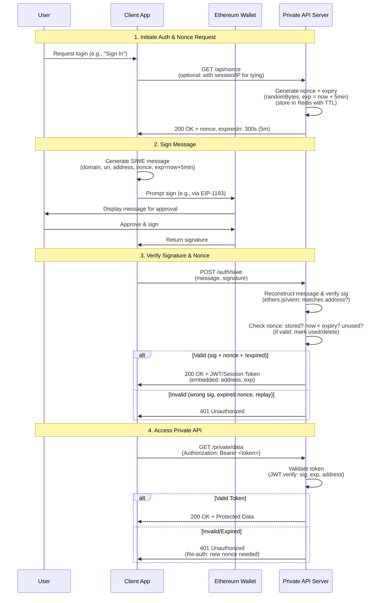

### Structure

- **apps/**: Contains deployable applications (e.g., `api`, `client`)
- **packages/**: Contains shared packages (e.g., `eslint-config`, `typescript-config`)

### Commands
Start local development servers for all apps
```sh
turbo run dev
```

Start linting all relevant codebases
```sh
turbo run lint
```

Start tests across the repo
```sh
turbo run test
```

Build all apps and packages in topological order
```sh
turbo run build
```

You can also run commands in specific apps/packages:
```sh
turbo run build --filter=client
turbo run dev --filter=api
```

## OTP with email
you should get email from authentication@notification.dynamicauth.com, with one time password for app called "self".


## The better auth flow for such apps should be:


## React issue
The same is at this example https://react.dev/reference/react/useActionState#display-information-after-submitting-a-form
